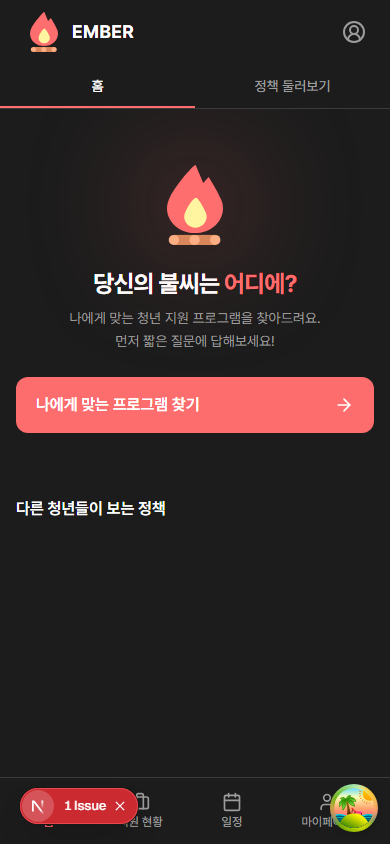
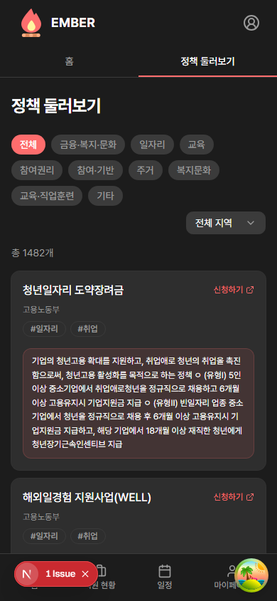
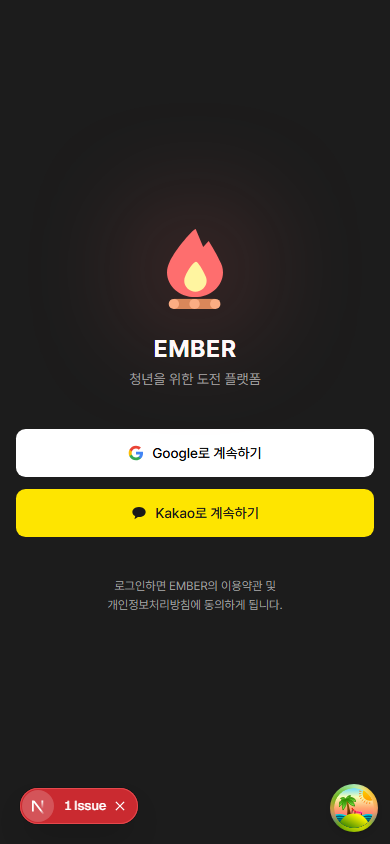

<div align="center">


# Ember

**이직과 취업을 준비하는 청년을 위한 올인원 플랫폼**

정부 지원 정책 탐색 · 맞춤 추천 · 지원서·일정 관리 · AI 기업 분석 · 푸시 알림

[](https://nextjs.org/)
[](https://react.dev/)
[](https://www.typescriptlang.org/)
[](https://www.prisma.io/)
[](https://tailwindcss.com/)
[](https://expo.dev/)

[🌐 Live](https://for-youth.site) · [📄 API Spec](docs/API_SPEC.md) · [🎨 Storybook](https://for-youth.site/storybook)

</div>

---

## 📸 Preview

<table>
  <tr>
    <td align="center" width="33%">
      <br/>
      <sub><b>Home</b> — 브랜드 Hero & 퀴즈 CTA</sub>
    </td>
    <td align="center" width="33%">
      <br/>
      <sub><b>Programs</b> — 1,482개 정부 정책 탐색</sub>
    </td>
    <td align="center" width="33%">
      <br/>
      <sub><b>Login</b> — Google & Kakao OAuth</sub>
    </td>
  </tr>
</table>

---

## ✨ Highlights

- **정책 맞춤 추천** — 몇 가지 질문에 답하면 1,400여 개 청년 정책 중 나에게 딱 맞는 프로그램을 스코어링해 Top-N으로 추천합니다.
- **지원서 전 주기 관리** — 회사·직무·자소서·마감일·채용 상태를 한 곳에서. 마감일은 자동으로 캘린더에 꽂히고, D-3 / D-1에 푸시 알림이 옵니다.
- **AI 기업 분석** — Anthropic Claude로 회사 개요·최근 뉴스·지원 동기 힌트를 자동 요약합니다.
- **모바일 네이티브 앱** — Expo + WebView로 iOS/Android 앱을 구성, Expo Push로 푸시를 백그라운드에서도 받아볼 수 있습니다.
- **배치 잡 자동화** — 온통청년 Open API를 밤마다 동기화하고, 아침엔 마감 임박 건을 골라 알림을 발송합니다.

## 🧩 Features

| 영역 | 기능 |
| --- | --- |
| **정책 탐색** | 카테고리·지역 필터, 검색, 조회수 기반 HOT 섹션, 마감일 기반 정렬 |
| **맞춤 추천** | 5단계 퀴즈 → 룰 기반 스코어링 → 개인화 Top-N (비로그인도 localStorage로 유지) |
| **지원서 관리** | CRUD · 소프트 삭제 · 진행 상태 8단계 · 자소서 유형별 분류 (9종) |
| **일정 캘린더** | 수동 일정 + 지원서 마감일 자동 이벤트 병합, 월 단위 조회 |
| **알림 시스템** | 신규 정책 매칭 / 마감 D-3·D-1 / 상태 변경 · 중복 방지 `dedupeKey` |
| **마이페이지** | 학력·경력·자격증·어학·기술스택, 연·월 단위 취득일 입력 UX |
| **AI 요약** | Claude 기반 기업 개요·주요 사업·최근 뉴스·지원동기 힌트 자동 생성 |
| **맞춤법 검사** | 자소서 작성 중 `hanspell` 기반 한국어 맞춤법 검사 |
| **인증** | NextAuth v5 + Prisma Adapter · Google / Kakao OAuth |
| **모바일** | Expo Router · WebView 브리지 · Expo Notifications 푸시 토큰 연동 |

## 🛠 Tech Stack

### Frontend


### Backend & Data


### Mobile


### Quality & Tooling


## 🏗 Architecture

```
┌─────────────┐     ┌──────────────┐     ┌──────────────┐
│  Next.js    │───▶│  Route       │───▶│  Prisma /   │
│  App Router │     │  Handlers    │     │  Neon PG     │
└─────┬───────┘     └──────┬───────┘     └──────────────┘
      │                    │
      │ React Query        │ Batch jobs (nightly/morning)
      │ Zustand            │
      ▼                    ▼
┌─────────────┐     ┌──────────────────────┐
│  shadcn/ui  │     │  온통청년 Open API    │
│  Radix      │     │  Anthropic Claude    │
└─────────────┘     │  Expo Push Service   │
                    └──────────────────────┘

┌────────────────────────┐
│  Expo App (iOS/Android)│──▶  WebView + __PUSH_TOKEN__
│  expo-notifications    │     bridge 주입
└────────────────────────┘
```

### 디렉토리
```
my-app/
├─ app/                    # Next.js App Router (route groups)
│  ├─ (home)/              # 홈 & 정책 둘러보기
│  ├─ (tabs)/              # 지원 현황 · 자소서 · 마이페이지 · 알림
│  ├─ (schedule)/          # 일정 캘린더
│  ├─ api/                 # Route Handlers (REST + batch + AI)
│  ├─ login/ · quiz/       # 공개 페이지
│  └─ providers.tsx        # Session, Query, Theme providers
├─ components/
│  ├─ ui/                  # shadcn/ui 기반 원자 컴포넌트
│  └─ icons/               # 브랜드 아이콘
├─ lib/                    # 도메인 로직 (api, stores, utils, validation)
├─ prisma/                 # 스키마 & 마이그레이션
├─ mobile/                 # Expo React Native 앱
├─ e2e/                    # Playwright 테스트
├─ __tests__/              # Jest 단위 테스트
└─ docs/                   # API 스펙, 가이드, 스크린샷
```

## 🗄 Data Model (핵심)

- `User` — OAuth 프로필 + 이력서 JSON(학력·경력·자격증·어학·스택)
- `Application` — 지원서 · 8단계 상태 · 소프트 삭제 · 자소서 1:N
- `CoverLetter` — 자소서 유형 9종 (지원동기 · 성장과정 · 직무역량 · ...)
- `ScheduleEvent` — 코딩테스트/면접/서류 마감 일정
- `YouthPolicy` — 온통청년 Open API에서 동기화한 1,482개 정책
- `Notification` — `dedupeKey`로 중복 방지 · 4가지 타입
- `PushToken` — Expo 푸시 토큰

## 🚀 Getting Started

### 사전 요구사항
- Node.js 20+
- PostgreSQL (Neon 추천)
- Google / Kakao OAuth Client
- (선택) Anthropic API Key, 온통청년 API Key

### 실행
```bash
# 1) 의존성 설치
npm install

# 2) 환경변수 세팅
cp .env.example .env.local
# DATABASE_URL, AUTH_*, ANTHROPIC_API_KEY, YOUTH_API_SERVICE_KEY 입력

# 3) DB 스키마 적용
npm run db:push

# 4) 개발 서버
npm run dev
# → http://localhost:3000
```

### 모바일 앱
```bash
cd mobile
npm install
npm run android    # 또는 ios / web
```

### 유용한 스크립트
```bash
npm run lint              # ESLint
npx tsc --noEmit          # 타입 체크
npm test                  # Jest 단위 테스트
npx playwright test       # E2E
npm run storybook         # Storybook
npm run db:studio         # Prisma Studio
```

## 🧪 Testing Strategy

| 레이어 | 도구 | 대상 |
| --- | --- | --- |
| 단위 | **Jest** + Testing Library | 훅, 유틸, 컴포넌트 |
| 컴포넌트 문서 | **Storybook** + a11y addon | UI 원자·조합 컴포넌트 |
| 네트워크 목 | **MSW** | API 핸들러 테스트 |
| E2E | **Playwright** (Pixel 5 mobile preset) | 핵심 시나리오 |

## 📡 API

전체 REST 엔드포인트와 요청·응답 스펙은 [`docs/API_SPEC.md`](docs/API_SPEC.md)에 정리되어 있습니다.

대표 엔드포인트:
- `GET/POST /api/applications` — 지원서 CRUD
- `GET/POST/DELETE /api/schedule` — 월별 일정 + 마감일 자동 이벤트
- `POST /api/quiz/result` — 퀴즈 결과 저장 & 추천
- `GET /api/programs` — 정책 목록 (페이지네이션)
- `POST /api/recommend` — 룰 기반 정책 추천
- `POST /api/speller` — 한국어 맞춤법 검사
- `GET /api/batch/nightly` · `morning` — 크론용 배치 (CRON_SECRET bearer)

## 🤝 Contributing

코드 수정 시 다음 순서를 지킵니다.

```bash
npx eslint <file>       # 린트
npx tsc --noEmit        # 타입 체크
npx playwright test     # UI 회귀 (UI 변경 시)
```

자세한 가이드는 [`docs/claude/`](docs/claude/)를 참고하세요.
- [nextjs.md](docs/claude/nextjs.md) — App Router · API · 미들웨어
- [components.md](docs/claude/components.md) — shadcn/ui 사용 규칙
- [hooks.md](docs/claude/hooks.md) — 커스텀 훅
- [state.md](docs/claude/state.md) — Zustand · props 드릴링 정책
- [testing.md](docs/claude/testing.md) — 테스트 작성 방식

## 📄 License

Private project. © 2026 Ember.
